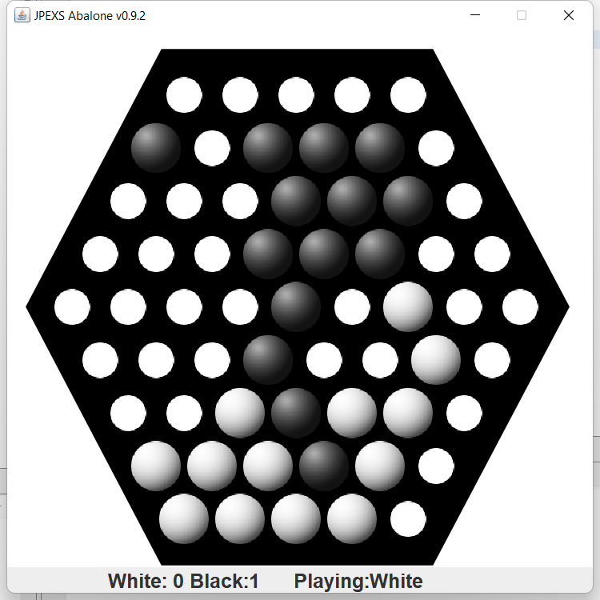

# abalone

Classic game Abalone - play with yourself or over the network.



## Usage

### Singleplayer game
```
java -jar Abalone.jar
```

### Network game - server
```
java -jar Abalone.jar -s <PORT>
```

### Network game - client
```
java -jar Abalone.jar -c <ADDRESS> <PORT>
```

## License
Game is licensed under GNU/LGPL version 2.1.

## Used software
JavaZoom JLayer for playing mp3 sounds (LGPL)
